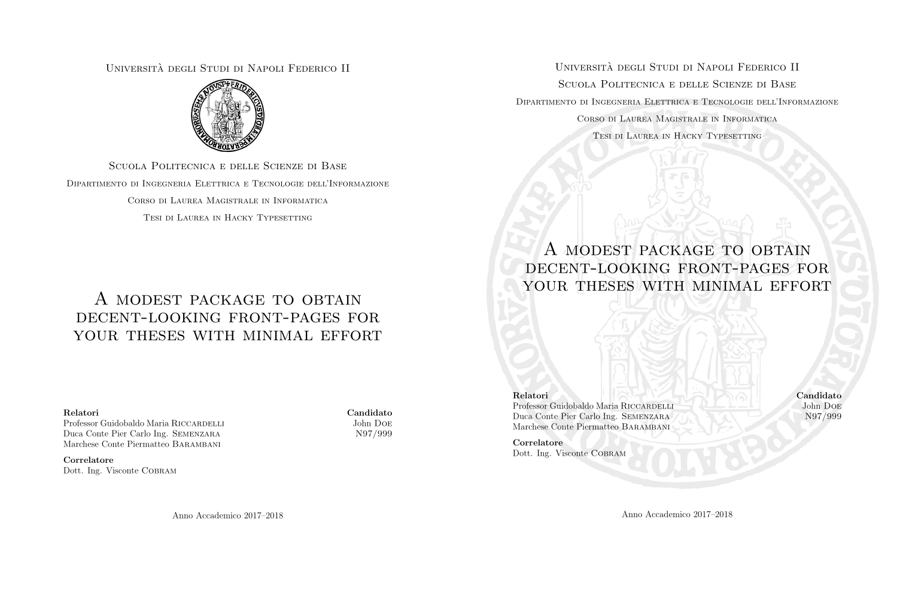

# unina-frontespizio
A modest, unofficial LaTeX package to obtain decent-looking front-pages for your theses (@ UniNA) with minimal effort.
See [example.pdf](example.pdf) for a sample.


## Features

* High quality "Federico II" vectorial logo included;
* Two styles (I recommend the classic one for the cover and the alternative one for the inner cover);
* UniNA guidelines compliant.

## Getting Started

1. Install the package by copying `uninafrontespizio.sty` to the `uninafrontespizio` directory inside your local `texmf`
directory tree (refer to your distro's documentation). Alternatively, just copy the package file to your LaTeX project's root.
2. Include the `uninafrontespizio` package in your document's preamble as follows.
``` latex
\usepackage{uninafrontespizio}
```
3. Customize your frontpage:
``` latex
\Universita{Università degli Studi di Napoli Federico II}
\Facolta{Scuola Politecnica e delle Scienze di Base}
\Dipartimento{Dipartimento di Ingegneria Elettrica e Tecnologie dell'Informazione}
\CorsoDiLaurea{Corso di Laurea Magistrale in Informatica}
\Materia{Tesi di Laurea in Hacky Typesetting} % optional
\AnnoAccademico{Anno Accademico 2017--2018}
\Titolo{A modest package to obtain decent-looking front-pages for your theses with minimal effort}
\Relatore{Professor Guidobaldo Maria \textsc{Riccardelli}}
\Relatore{Duca Conte Pier Carlo Ing. \textsc{Semenzara}}
\Relatore{Marchese Conte Piermatteo \textsc{Barambani}}
% can add as many "Relatori" as you wish
\RelatoreLabel{Relatori} %optional, default: Relatore
%\relandcorrelsep{2em} %optional, vertical space between relatori and correlatori default: 1.5ex
\Correlatore{Dott. Ing. Visconte \textsc{Cobram}}
%\Correlatore{Dott.Foo \textsc{Bar}} % can add as many "Correlatori" as you wish
%\CorrelatoreLabel{Controrelatore} %optional, default: Correlatore
\Candidato{John \textsc{Doe}} %only one candidate is currently supported
%\CandidatoLabel{Candidata} %optional, default: Candidato
\Matricola{N97/999}
\Logo{logo-federico-II.pdf} %path to logo image
\LogoWidth{3.5cm} %optional, default: 3cm
\LogoPosition{below-uni} % or top, or below-title, or above-title, or no-logo
```
4. Generate front pages by using `\makefrontpage` (classic style) and/or `\makefrontpagealt` (alternative style)

For an example, see the `example.tex` file.

## License

This project is licensed under the GPL v3 License - see the [LICENSE](LICENSE) file for details.

